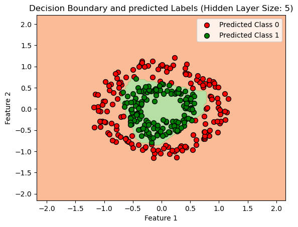

# 🧠 MLP Decision Boundary Visualizer

An interactive demo that shows how the size of the hidden layer in a neural network (MLPClassifier) affects its ability to classify non-linearly separable data — specifically a dataset of concentric circles.

## 📊 Overview

This project uses:

- A **synthetic dataset** of two concentric circles generated with `make_circles`.
- A **Multi-Layer Perceptron (MLP)** classifier from scikit-learn.
- **Matplotlib** for visualization.
- **IPyWidgets** to create an interactive slider to control the number of neurons in the hidden layer.

The goal is to visualize how increasing the number of neurons in the hidden layer impacts the decision boundary learned by the model.

## 🧪 Dataset

The dataset is generated using `make_circles` from `sklearn.datasets`.  
It consists of 300 two-dimensional points grouped into two classes (inner and outer circle).

## ⚙️ How It Works

1. A neural network is trained on the generated data.
2. A grid of points is used to visualize the predicted class for each region.
3. The decision boundary and classified data points are plotted.
4. A slider lets you change the **hidden layer size** from 1 to 10 neurons.
5. The plot updates automatically to show how the network learns with different capacities.

